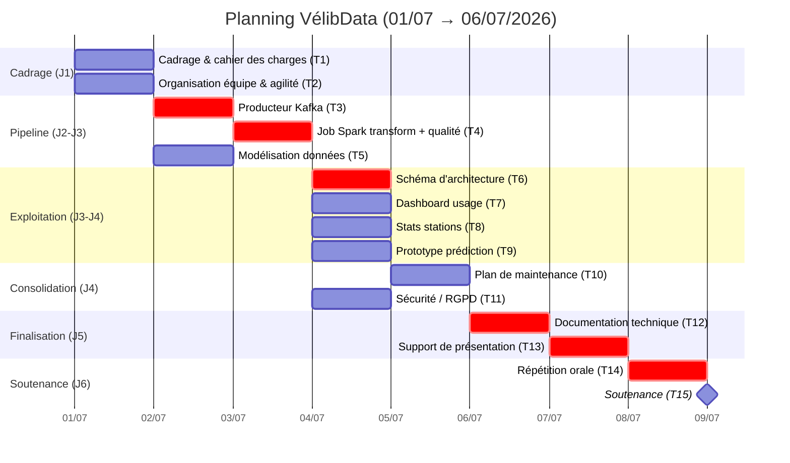

# Planning projet — WBS, Gantt et chemin critique

Contexte : préparation resserrée sur **39h / 6 jours calendaires** (du 01/07/2026 au 06/07/2026, date de soutenance). Le sujet impose une approche itérative avec livraison d'un **MVP amélioré progressivement** — le planning est construit en ce sens.

## 1. Découpage du projet en tâches (WBS)

| ID | Tâche | Ressource(s) | Durée | Dépend de |
|---|---|---|---|---|
| T1 | Cadrage projet, architecture cible, cahier des charges | Victory (pilotage), toute l'équipe | 0,5 j | — |
| T2 | Organisation d'équipe, outillage agile (Trello/GitHub) | Victory | 0,5 j | — |
| T3 | Producteur Kafka (API stations + disponibilité → topics) | Victory | 1 j | T1 |
| T4 | Job Spark : transformation, règles de qualité, écriture MinIO | Victory | 1 j | T3 |
| T5 | Modélisation normalisée des données | Victory + Lucas (revue) | 0,5 j | T1 |
| T6 | Schéma d'architecture + justification des choix | Victory | 0,5 j | T4 |
| T7 | Prototype tableau de bord d'usage | Belkis | 1 j | T4 |
| T8 | Statistiques descriptives / performance des stations | Lucas | 1 j | T4 |
| T9 | Prototype modèle de prédiction de la demande | Lyes | 1 j | T4 |
| T10 | Plan de maintenance (pannes, défaillances, améliorations) | Victory | 0,5 j | T4, T6 |
| T11 | Sécurité & conformité RGPD (secrets, localisation UE) | Victory | 0,5 j | T3, T4 |
| T12 | Documentation technique consolidée | Victory | 0,5 j | T6, T10, T11 |
| T13 | Support de présentation | Toute l'équipe | 0,5 j | T7, T8, T9, T12 |
| T14 | Répétition orale | Toute l'équipe | 0,5 j | T13 |
| T15 | Soutenance | Toute l'équipe | 20 mn + 30 mn | T14 |

## 2. Diagramme de Gantt

## 3. Chemin critique

**T1 → T3 → T4 → T6 → T10 → T12 → T13 → T14 → T15**

Ce chemin conditionne directement la date de soutenance : tout retard sur le producteur Kafka (T3) ou le job Spark (T4) se répercute mécaniquement sur la documentation et le support de présentation. Les tâches T5 (modélisation), T7, T8, T9 (livrables métier des Data Analysts/Scientist) disposent d'une marge car elles ne bloquent pas directement T6/T10.

## 4. Objectifs délais et jalons

| Jalon | Date | Contenu |
|---|---|---|
| Lancement | 01/07/2026 | Cadrage validé, environnement Docker opérationnel pour toute l'équipe |
| Jalon MVP technique | 03/07/2026 | Pipeline Kafka → Spark → MinIO fonctionnel de bout en bout |
| Jalon livrables | 05/07/2026 (soir) | Ensemble des documents et du support de présentation finalisés |
| Soutenance | 06/07/2026 | Présentation orale (20 mn) + entretien jury (30 mn) |

## 5. Objectifs coûts

Budget infrastructure : **0 €** (stack open source auto-hébergée en local via Docker Compose : Kafka, Zookeeper, MinIO, Spark). Seul coût réel : temps humain, budgétisé à 39h de préparation réparties entre les 4 membres de l'équipe (~9,75h/personne), affecté selon la table WBS ci-dessus.
