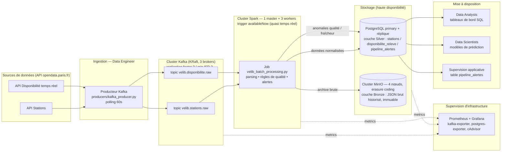

# Architecture technique — VélibData

## 1. Schéma d'architecture



Déploiement : `docker-compose.yml` (usage quotidien, cf. [README.md](../../mspr-tech/README.md)) ou manifestes Kubernetes équivalents avec autoscaling des workers Spark (cf. [mspr-tech/k8s/](../../mspr-tech/k8s/README.md)).

## 2. Explication des flux
1. Le **producteur Kafka** interroge les 2 API Vélib' toutes les 60 secondes (contrainte du sujet : « ne pas pousser l'aspect temps réel trop loin ») et publie chaque réponse brute, telle quelle, sur un topic Kafka dédié.
2. **Kafka** découple l'ingestion du traitement : si Spark est indisponible, les messages restent dans le topic et sont traités au retour du service (résilience aux pannes).
3. Le **job Spark** (Structured Streaming, trigger `availableNow`) se déclenche périodiquement, ne traite que les messages non encore lus (position mémorisée par un *checkpoint*), applique les règles de qualité, puis écrit :
   - une copie brute immuable dans **MinIO** (couche *bronze*, pour l'historisation et la ré-exécution en cas de besoin) ;
   - les données validées et normalisées dans **PostgreSQL** (couche *silver*, requêtable en SQL par les Data Analysts/Scientists) ;
   - toute anomalie détectée dans la table de supervision `pipeline_alertes`.

## 3. Justification des choix techniques

| Choix | Justification |
|---|---|
| **Kafka en mode KRaft** (sans Zookeeper) | Zookeeper est en fin de vie dans l'écosystème Kafka ; le mode KRaft réduit le nombre de services à administrer/superviser (compétence Bloc 4 : « administrer la plateforme »), tout en gardant la même garantie de découplage producteur/consommateur. |
| **MinIO (S3-compatible) auto-hébergé** | Répond à la contrainte RGPD (localisation des données en France/UE) tout en offrant une API standard S3, portable vers un cloud européen si besoin de montée en charge. |
| **Spark Structured Streaming, trigger `availableNow`** | Illustre le principe du calcul parallèle (compétence Bloc 4) tout en respectant la contrainte « ne pas pousser le temps réel trop loin » : le job tourne en micro-batch à la demande plutôt qu'en flux continu 24/7, ce qui est suffisant pour une API rafraîchie toutes les minutes. |
| **PostgreSQL pour la couche silver** | Répond à la contrainte « base de données normalisée capable de gérer des volumes croissants et d'assurer une requête efficace » (contrainte III du sujet) — modèle relationnel indexé, contraintes d'intégrité (clé étrangère station_id, unicité station+horodatage). |
| **I/O (MinIO/Postgres) pilotés depuis le driver Spark via boto3/psycopg2, plutôt que connecteurs S3A/JDBC natifs** | Choix pragmatique pour le MVP : à l'échelle Vélib' (~1500 stations par cycle), le volume par micro-batch est faible et collecter les lignes validées sur le driver évite les problèmes de compatibilité de versions de connecteurs (S3A/Hadoop, driver JDBC) dans le délai imparti. **Piste d'évolution identifiée** (cf. plan de maintenance) : basculer vers les connecteurs natifs Spark si le volume par micro-batch venait à dépasser la mémoire du driver. |
| **Versions d'images figées** (`cp-kafka:7.6.1`, `spark-py:v3.4.0`, `postgres:16-alpine`, `minio:RELEASE.2024-01-16`...) | Reproductibilité du déploiement entre les membres de l'équipe et lors de la soutenance — un `docker-compose.yml` utilisant `:latest` a d'ailleurs été identifié comme la cause de la panne initiale de Kafka (cf. plan_maintenance.md, incident #1). |

## 4. Principe de parallélisme démontré
Le job Spark exécute deux requêtes Structured Streaming **en parallèle** (une par topic Kafka), chacune répartissant le parsing JSON et le filtrage qualité sur les exécuteurs du cluster (3 `spark-worker`, cf. section 5). La phase d'écriture (I/O MinIO/Postgres) s'exécute sur le driver via `foreachBatch`, ce qui a d'ailleurs révélé en test une **condition de course** entre les deux requêtes parallèles lors de la création du bucket MinIO (les deux tentaient de le créer simultanément) — corrigée en absorbant l'exception `BucketAlreadyOwnedByYou`, une illustration concrète des enjeux de concurrence propres au calcul parallèle.

## 5. Cluster tolérant aux pannes ("zéro panne")

Chaque composant de la plateforme est déployé en **plusieurs nœuds redondants** plutôt qu'en instance unique, afin que la perte d'un nœud n'interrompe pas le service (critère Bloc 4 « configurer des clusters de nœuds... afin d'assurer une tolérance de zéro panne ») :

| Composant | Topologie | Tolérance de panne |
|---|---|---|
| **Kafka** | 3 brokers en mode KRaft (quorum de contrôleurs), `replication.factor=3`, `min.insync.replicas=2` | Perte d'1 broker sur 3 : zéro interruption, zéro perte de message (2 répliques synchrones restantes) |
| **MinIO** | 4 nœuds distribués avec *erasure coding* derrière un load-balancer (`minio-lb`, nginx) | Perte de 1 à 2 nœuds/disques sur 4 : les objets restent lisibles/réparables (parité EC) |
| **PostgreSQL** | 1 primary + 1 réplique en streaming replication physique (WAL) | Perte du primary : bascule manuelle documentée (`pg_ctl promote` sur la réplique, cf. [plan_maintenance.md](plan_maintenance.md)) ; perte de la réplique : aucun impact applicatif (lecture seule) |
| **Spark** | 1 master + 3 workers | Perte d'1 worker sur 3 : les tâches sont réassignées aux workers restants (mécanisme natif du scheduler Spark standalone) |

Calibrage retenu : `replication.factor=3` / `min.insync.replicas=2` pour Kafka est le compromis standard entre disponibilité (tolère la perte d'1 nœud) et coût de stockage (x3 plutôt que x5) — cohérent avec un cluster de 3 nœuds. Le taux de réplication MinIO (erasure coding sur 4 nœuds) tolère la perte de la moitié des disques sans perte de données, au prix d'un surcoût de stockage inférieur à une réplication complète (x2 à x4 selon le schéma EC choisi).

Bascule du primary PostgreSQL en cas de panne (procédure manuelle documentée, pas d'automatisation de failover dans le MVP — piste d'évolution : Patroni/repmgr) :
```bash
docker exec mspr-tech-postgres-replica-1 pg_ctl promote -D /var/lib/postgresql/data
# Puis reconfigurer POSTGRES_HOST=postgres-replica dans .env et redemarrer les consommateurs.
```

## 6. Équivalences avec les concepts HDFS/ZooKeeper de la grille d'évaluation

Le sujet impose une plateforme Big Data distribuée mais laisse le choix des outils. L'équipe a retenu **Kafka + MinIO + PostgreSQL** plutôt que **HDFS** (cf. section 3, justification par composant). Certains critères de la grille Bloc 4 sont formulés avec le vocabulaire HDFS (heartbeat, auto-balancing, DataNodes, ZooKeeper, Chukwa) : le tableau ci-dessous explicite l'équivalent fonctionnel réellement implémenté dans notre stack, pour lever toute ambiguïté à la soutenance.

| Concept HDFS (grille) | Équivalent implémenté | Où |
|---|---|---|
| **Heartbeat** (NameNode ↔ DataNodes) | `healthcheck` Docker (intervalle/timeout/retries) sur chaque service ; protocole de heartbeat natif du quorum de contrôleurs Kafka (KRaft) ; `wal_sender`/`wal_receiver` PostgreSQL entre primary et réplique | `docker-compose.yml` (blocs `healthcheck`), section 5 ci-dessus |
| **Auto-balancing** (rééquilibrage des blocs entre DataNodes) | Réélection de leader et réassignation des partitions Kafka entre les 3 brokers (`kafka-reassign-partitions` si rebalance manuel nécessaire) ; répartition erasure-coded des objets entre les 4 nœuds MinIO, gérée nativement par le moteur EC | Cluster Kafka (section 5) ; cluster MinIO (section 5) |
| **Checksums** (intégrité des blocs) | CRC32 par enregistrement Kafka (natif du protocole) ; protection bitrot par nœud/disque de MinIO (vérification à la lecture) ; `data_checksums` activable sur PostgreSQL | Natif aux images utilisées, pas de configuration applicative supplémentaire |
| **DataNodes** (stockage distribué des blocs) | Les 4 nœuds MinIO (erasure coding) remplacent le rôle de stockage distribué des DataNodes HDFS ; les 3 brokers Kafka assurent le rôle de « journal distribué » (WAL) que HDFS ne couvre pas nativement | `docker-compose.yml`, services `minio1`–`minio4` |
| **ZooKeeper** | Volontairement retiré : le mode **KRaft** de Kafka (3.x+) intègre le rôle de ZooKeeper (métadonnées de cluster, élection de leader) directement dans les brokers via un quorum Raft — un service de moins à administrer/superviser, cf. section 3 | `docker-compose.yml`, `KAFKA_PROCESS_ROLES: broker,controller` |
| **Chukwa** (agrégation de logs/métriques) | Remplacé par la stack de supervision **Prometheus + Grafana** (section 8) pour les métriques d'infrastructure, et par la table applicative `pipeline_alertes` pour les anomalies métier | Section 8 ; [plan_maintenance.md](plan_maintenance.md) |

## 7. Chaîne d'intégration continue (CI/CD)

Une chaîne d'automatisation *compilation → tests → déploiement* est mise en place via **GitHub Actions** (`.github/workflows/ci.yml`, déclenchée à chaque push/pull request) :

1. **lint-test** : analyse statique du code Python (`flake8`) + tests unitaires (`pytest`) des règles de qualité de données (`mspr-tech/tests/test_quality_rules.py`, 13 cas couvrant `is_station_valid`/`is_disponibilite_valid` — bbox Paris, capacité négative, cohérence vélos/docks/capacité, tolérance de mesure).
2. **validate-compose** : valide la syntaxe et l'interpolation des variables de `docker-compose.yml` (`docker compose config`).
3. **validate-k8s** : valide les manifestes Kubernetes (`mspr-tech/k8s/`) contre le schéma officiel Kubernetes hors-ligne, via [kubeconform](https://github.com/yannh/kubeconform) — représente l'étape « déploiement » de la chaîne, sans nécessiter de cluster réel à chaque exécution CI.

Les règles de qualité ont été extraites dans un module dédié sans dépendance à PySpark (`mspr-tech/spark_jobs/quality_rules.py`) spécifiquement pour être testables unitairement en quelques millisecondes dans la CI, sans démarrer Spark ni l'infrastructure Docker.

## 8. Supervision d'infrastructure (monitoring)

En complément des alertes applicatives (`pipeline_alertes`, cf. [plan_maintenance.md](plan_maintenance.md)), une stack de supervision dédiée est intégrée à `docker-compose.yml` :

| Service | Rôle |
|---|---|
| **Prometheus** (`:9090`) | Collecte des métriques (scrape 15s) de tous les composants ci-dessous |
| **Grafana** (`:3000`) | Tableau de bord `VelibData - Vue d'ensemble infrastructure` provisionné automatiquement (brokers Kafka en ligne, débit par topic, connexions/lag de réplication PostgreSQL, CPU/mémoire par conteneur, workers Spark enregistrés) |
| **kafka-exporter** (`:9308`) | Débit, lag consommateurs, état du cluster Kafka |
| **postgres-exporter** (`:9187`) | Connexions actives, lag de réplication, taille de base |
| **cAdvisor** (`:8085`) | CPU/mémoire/IO par conteneur — détection de fuites mémoire et de dérives de performance |
| **Spark PrometheusServlet** | Métriques du master (`spark-master:8080/metrics/master/prometheus`) via `monitoring/spark-metrics.properties` |

## 9. Orchestration et autoscaling (Kubernetes)

Pour répondre au critère « dimensionner en temps réel les besoins en consommation de ressources en mettant en place l'autoscaling », des manifestes Kubernetes équivalents à `docker-compose.yml` sont fournis dans [`mspr-tech/k8s/`](../../mspr-tech/k8s/README.md) : StatefulSets pour Kafka/MinIO/PostgreSQL, et surtout un **HorizontalPodAutoscaler** sur le Deployment `spark-worker` (2 à 6 réplicas, cible 70% CPU) qui absorbe automatiquement les montées en charge du traitement, sans intervention manuelle. Cette architecture n'est pas celle utilisée au quotidien pour le MVP (6 jours de préparation, cf. planning.md) mais constitue la cible d'industrialisation documentée et testable (minikube/k3d).
