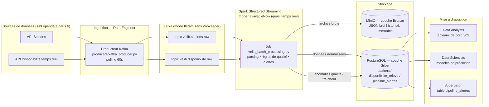

# Architecture technique — VélibData

## 1. Schéma d'architecture

## 2. Explication des flux
1. Le **producteur Kafka** interroge les 2 API Vélib' toutes les 60 secondes (contrainte du sujet : « ne pas pousser l'aspect temps réel trop loin ») et publie chaque réponse brute, telle quelle, sur un topic Kafka dédié.
2. **Kafka** découple l'ingestion du traitement : si Spark est indisponible, les messages restent dans le topic et sont traités au retour du service (résilience aux pannes).
3. Le **job Spark** (Structured Streaming, trigger `availableNow`) se déclenche périodiquement, ne traite que les messages non encore lus (position mémorisée par un *checkpoint*), applique les règles de qualité, puis écrit :
   - une copie brute immuable dans **MinIO** (couche *bronze*, pour l'historisation et la ré-exécution en cas de besoin) ;
   - les données validées et normalisées dans **PostgreSQL** (couche *silver*, requêtable en SQL par les Data Analysts/Scientists) ;
   - toute anomalie détectée dans la table de supervision `pipeline_alertes`.

## 3. Justification des choix techniques

| Choix | Justification |
|---|---|
| **Kafka en mode KRaft** (sans Zookeeper) | Zookeeper est en fin de vie dans l'écosystème Kafka ; le mode KRaft réduit le nombre de services à administrer/superviser (compétence Bloc 4 : « administrer la plateforme »), tout en gardant la même garantie de découplage producteur/consommateur. |
| **MinIO (S3-compatible) auto-hébergé** | Répond à la contrainte RGPD (localisation des données en France/UE) tout en offrant une API standard S3, portable vers un cloud européen si besoin de montée en charge. |
| **Spark Structured Streaming, trigger `availableNow`** | Illustre le principe du calcul parallèle (compétence Bloc 4) tout en respectant la contrainte « ne pas pousser le temps réel trop loin » : le job tourne en micro-batch à la demande plutôt qu'en flux continu 24/7, ce qui est suffisant pour une API rafraîchie toutes les minutes. |
| **PostgreSQL pour la couche silver** | Répond à la contrainte « base de données normalisée capable de gérer des volumes croissants et d'assurer une requête efficace » (contrainte III du sujet) — modèle relationnel indexé, contraintes d'intégrité (clé étrangère station_id, unicité station+horodatage). |
| **I/O (MinIO/Postgres) pilotés depuis le driver Spark via boto3/psycopg2, plutôt que connecteurs S3A/JDBC natifs** | Choix pragmatique pour le MVP : à l'échelle Vélib' (~1500 stations par cycle), le volume par micro-batch est faible et collecter les lignes validées sur le driver évite les problèmes de compatibilité de versions de connecteurs (S3A/Hadoop, driver JDBC) dans le délai imparti. **Piste d'évolution identifiée** (cf. plan de maintenance) : basculer vers les connecteurs natifs Spark si le volume par micro-batch venait à dépasser la mémoire du driver. |
| **Versions d'images figées** (`cp-kafka:7.6.1`, `spark-py:v3.4.0`, `postgres:16-alpine`, `minio:RELEASE.2024-01-16`...) | Reproductibilité du déploiement entre les membres de l'équipe et lors de la soutenance — un `docker-compose.yml` utilisant `:latest` a d'ailleurs été identifié comme la cause de la panne initiale de Kafka (cf. plan_maintenance.md, incident #1). |

## 4. Principe de parallélisme démontré
Le job Spark exécute deux requêtes Structured Streaming **en parallèle** (une par topic Kafka), chacune répartissant le parsing JSON et le filtrage qualité sur les exécuteurs du cluster (`spark-worker`, extensible horizontalement en ajoutant des réplicas de service dans `docker-compose.yml`). La phase d'écriture (I/O MinIO/Postgres) s'exécute sur le driver via `foreachBatch`, ce qui a d'ailleurs révélé en test une **condition de course** entre les deux requêtes parallèles lors de la création du bucket MinIO (les deux tentaient de le créer simultanément) — corrigée en absorbant l'exception `BucketAlreadyOwnedByYou`, une illustration concrète des enjeux de concurrence propres au calcul parallèle.
