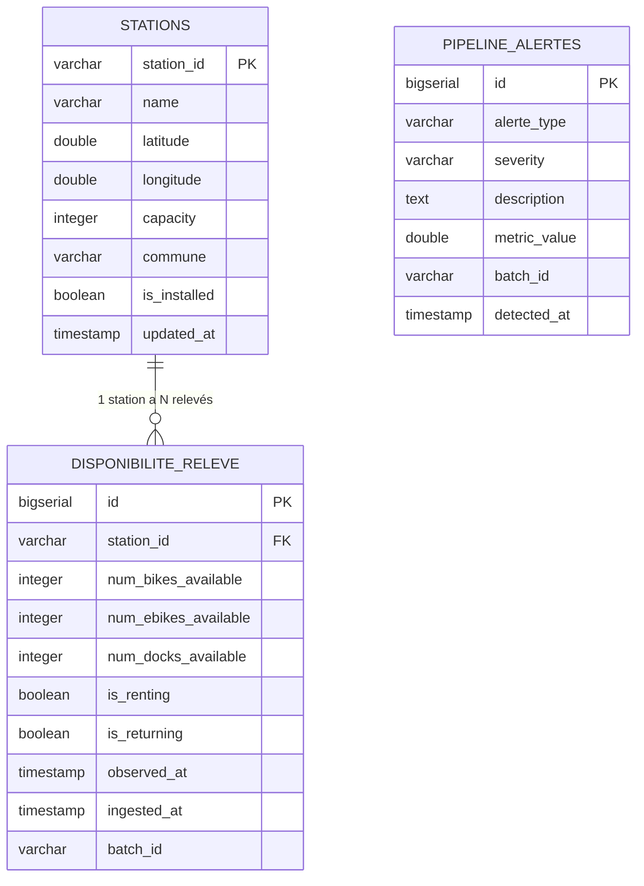

# Modélisation normalisée des données

Script de création : [`mspr-tech/sql/init_schema.sql`](../../mspr-tech/sql/init_schema.sql) (chargé automatiquement au démarrage du conteneur PostgreSQL).

## 1. Modèle entité-association

## 2. Justification de la normalisation
- **`stations`** est la dimension (référentiel) : chaque station n'existe qu'une fois, mise à jour par upsert (`ON CONFLICT ... DO UPDATE`) à chaque cycle d'ingestion. Évite la duplication de la localisation/capacité à chaque relevé.
- **`disponibilite_releve`** est la table de faits, historisée : un enregistrement par (station, horodatage), avec une contrainte d'unicité `(station_id, observed_at)` qui empêche les doublons en cas de re-traitement d'un même message Kafka.
- La **clé étrangère** `disponibilite_releve.station_id → stations.station_id` garantit l'intégrité référentielle : aucun relevé ne peut être inséré pour une station inconnue (contrainte volontairement stricte, cf. décision d'architecture ci-dessous).
- **`pipeline_alertes`** découple la supervision de la donnée métier : elle peut être interrogée indépendamment pour construire un tableau de bord de suivi qualité/disponibilité sans requêter les tables volumineuses.
- **Index** `idx_disponibilite_station_time` sur `(station_id, observed_at DESC)` : optimise les requêtes d'historique par station (cas d'usage principal des Data Analysts/Scientists — séries temporelles).

## 3. Décision d'architecture notable : référentiel de secours
En test réel, le flux `disponibilite` a renvoyé des stations absentes de l'échantillon du flux `stations` (les deux API sont interrogées indépendamment avec une pagination différente), ce qui a fait échouer la contrainte de clé étrangère. Plutôt que d'assouplir la contrainte (au risque de perdre l'intégrité des données), le job Spark **upserte un enregistrement minimal dans `stations`** à partir des champs déjà présents dans le flux `disponibilite` (nom, capacité, coordonnées) avant d'insérer le relevé — les deux flux restent ainsi fonctionnellement indépendants sans compromettre le modèle normalisé.

## 4. Volumétrie et capacité à monter en charge
- ~1500 stations Vélib' à Paris → ~1500 lignes `disponibilite_releve` par cycle d'ingestion (60s) → **~2,16 millions de lignes/jour** en régime permanent.
- Le modèle relationnel indexé + partitionnement possible par date (évolution documentée dans le plan de maintenance) permet d'absorber cette croissance sans dégradation des requêtes d'historique.
